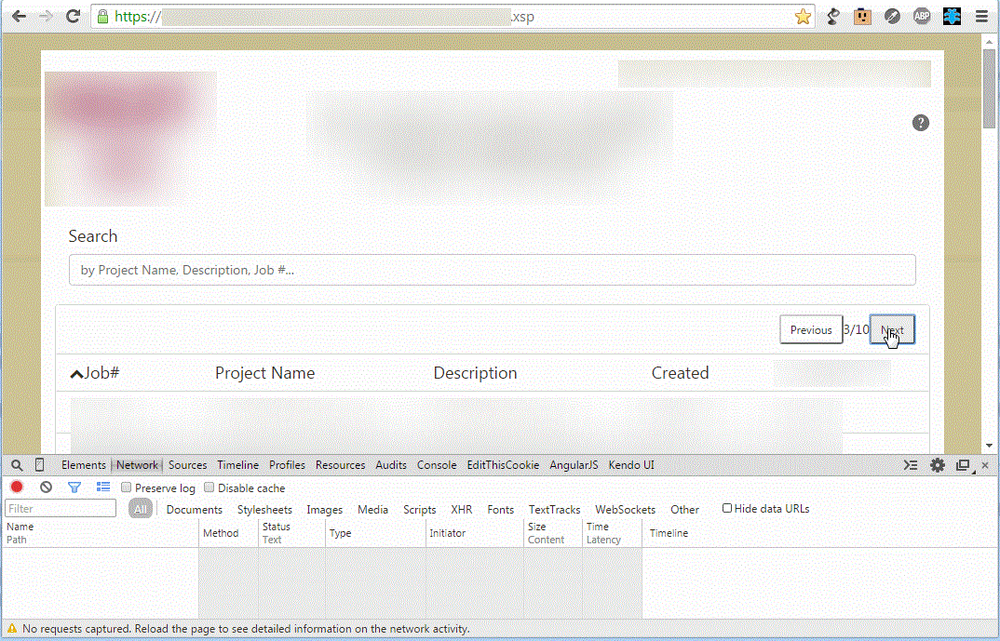
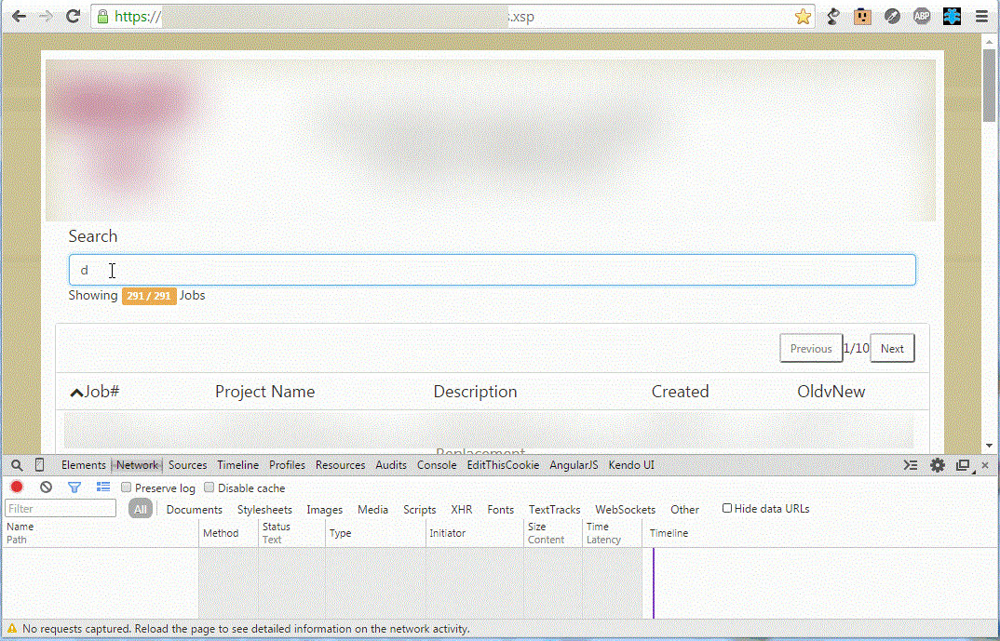

[EDIT]

#### Regarding XHRs

XMLHTTPRequests encompass nearly every partial refresh under the sun. I loosely describe AJAX calls (and XPages' dojo.xhrPost calls) to encompass "fat XHRs", or XHRs which include _markup_ in their response. This is a terrible way of doing business, as we as developers ought to _ligthen the load_ a bit in the age of mobile devices and cellular connections. I touched on this when I originally wrote the post, but thought that it could use some clarification up front. So, transport data for partials, not markup.

[/EDIT]

### REST is Best

Recently I became a father. It's pretty awesome. I've got a daughter who gives me some pretty good smiles and other funny faces, so I've always got some good motivation to go home at the end of the day. This also means I've gone through some birthing classes in recent history. So consider this post's title to be a play on words, regarding the interpretation of infant feeding. You know, the old adage of "&lt;piece of mammalian anatomy that rhymes with REST&gt; is best" (unless contraindicated by medical or other conditions).

### Why is AJAX Not Good Enough?

My last post, [How to Bore Your Audience](/xpages/unraveling-the-mvc-mysteries/), spent a bit of time on the "big picture", for the structure of modern and awesome XPage applications. It also outlined my general distaste for overly large AJAX calls (specifically dojo xhrPost) when a simpler method (at least an xhrGet) would suffice. AJAX can return JSON data, though it is, by default, Asynchronous JS and **XML**. So what AJAX really is, if we're data format agnostic, is really just a programmatic network call to return a data payload of _something_.

XPages does this by that dojo xhrPost call to call out where (the _partialRefresh_ id) to inject/replace the newly returned data. This happens to be (usually) HTML, a Dojo data store (in the event of an _xp:restService_ control, depending on your properties), and more (like if you refresh an _xp:scriptBlock_). This works, but when you keep your application logic on the server (and I suggest you do), that means you're often sending increasing amounts of information back and forth, in a partial(Refresh) capacity.

### REST is Lean

Having recently read Paul Akers' book, [_2 Second Lean_](https://2secondlean.com/), and having seen him speak in-person, I can honestly say that when I look at a process, I think "I see waste" and I want to eliminate it. This is a part of what we do as developers, and I'm sure is intuitive to you, but we must always strive for the path of least resistance in our applications. It makes for better application structure and better user experiences.

Without the need for an in-memory session on the server, we no longer require a session ["state"](<https://en.wikipedia.org/wiki/State_(computer_science)#Program_state>). To get the data we need, we have to formulate what to request in the client, using the browser's JavaScript, and then execute the call and handle its receipt. Many of the modern JavaScript frameworks out there, like my beloved [AngularJS](https://angularjs.org/), automate this process. To do so, they use a combination of http event handlers ([\$http](https://docs.angularjs.org/api/ng/service/$http) in Angular) and callback functions. In the XPages world, think of the CSJS event functions for _onComplete_ and _onError_ (etc.) which we use in _xp:eventHandler_ tags.

Let's compare a simple thing in XPages. Using the stock xp:viewPanel, xp:pager, with the _partialRefresh_ option, this is a fairly normal way for an XPage developer to put a View into an XPage. This is also my hallmark argument against this variety of implementation, for such a simple task. Here's what happens when I hit "Next" in the pager:

When we execute these AJAX calls, it takes time and processing effort (both for the server and the client/browser). Here's what I mean:

The above doesn't show a whole lot of time elapsing, only about 38ms. It also shows a hover state being fetched; I didn't even plan on that (and is an argument against Dojo, IMO; I mean, lazy loading images for button styles?!?). I can also tell you that that server is having a good day and isn't refreshing anything more than the _xp:viewPanel_ for this page (so less intense computations). The application above has been re-developed, as a case study (with which I've been able to sell to my management and direct my development efforts accordingly), into a Bootstrap 3 with AngularJS application. Here's what happens when I perform the same paging task in the Angular version of this app. Apologies for the reduction in quality with the gif and redaction of company-specific information.

No network requests during paging, it's that cool. What's happening? It's behaving as a modern web application; a single page app, in fact, but I'll get to some of those specifics in a moment. Here's the same page again, with live full-text searching, across all fields (keys, as in JSON key: value pair, you can also filter by key) in the data array.

So why is REST lean? REST means a less cluttered network request, performed less frequently. This also comes down to your implementation of it, which is why I'm showing off Angular, which plays to a RESTful API's strengths. The idea is to invoke _just what you need_ from the server, at the state of what you're looking for, [HATEOAS style](https://en.wikipedia.org/wiki/HATEOAS). You still have to load a page with a JavaScript library to know what to invoke, but you should reduce as much as possible afterwards.

### SPAs and Application Structure

You knew I was going to bring up application structure, didn't you? The dichotomy of the server-side application logic and the client-side application logic must be apparent now. It's precisely why, when [Mark Roden](https://twitter.com/markyroden) gave his [Write Once, Run Anywhere: Angular.js in XPages](https://xomino.com/2014/09/02/mwlug-2014-slide-deck-write-once-run-anywhere-angular-js-in-xpages/) session at MWLUG, he admitted (begrudgingly, I might add) that to properly build a larger application, a developer would want to enforce application and work flow validation on the server; aka- ["everybody needs a Toby"](https://twitter.com/tsamples). This would be done by writing a custom servlet or REST implementation, which would validate before directly committing into a Domino document. If your application is simple and your field data is strictly textual and you trust your users to not put bogus data into their network POST or PUT operations, DDS is great.

### Domino Data Services

This is the biggest downside of the Domino Data Service in my opinion. The Domino Data Service gives us the ability to perform the CRUD operations against Domino Documents and Views, but there's no computeWithForm, which would give us as least a way of invoking an agent on save. But, it's better than nothing. So, would a developer benefit from structuring their application with data models and controller classes? Absolutely! In fact, you might think there was a reason I wrote [that long winded post last](/xpages/unraveling-the-mvc-mysteries/) before this one ;-).

### Summarizing

As you can see, M-V-C is a thing. It's great idea for your server-side application logic and there are a great many awesome M-V-C client-side frameworks (like Angular) that can help you expedite your front-end logic. So please, let's build better apps. REST can get us there with lighter weight network requests and in-browser processing of data and application logic. We can reduce our network calls, sizes of data transferred, and made our performance response time nearly negligible (limited only to the time it takes the client-side JS code to perform the rebuild of the HTML and the initial page load).

No silly Keanu, it just might keep us sane.
