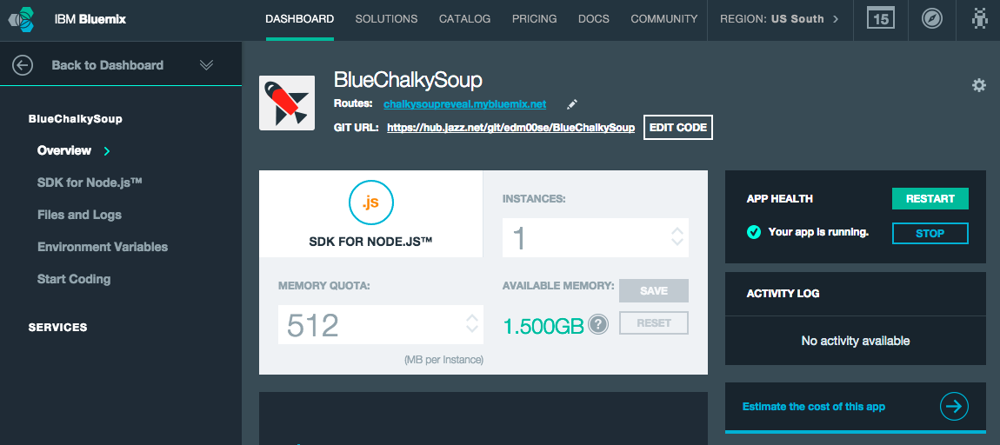
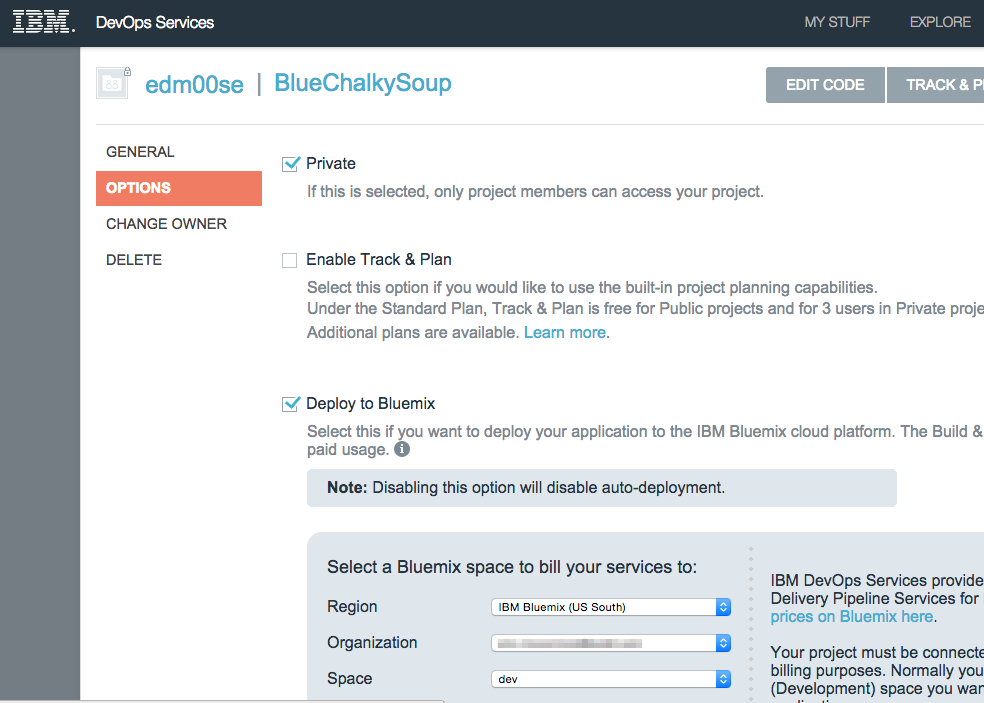
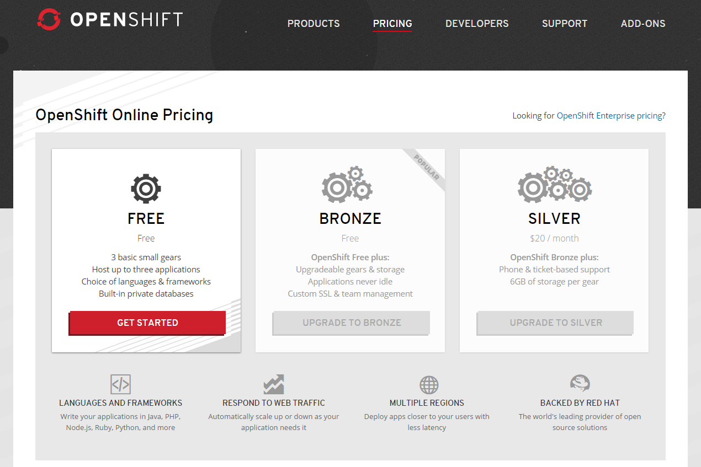

### Blue Chalky Soup

This is the code name I gave my boiled down session to keep it more in fitting with IBM's description of a Chalk Talk, I got interesting with things. Specifically a reveal.js mini presentation (mostly so I could give people further reading or references and resources), served by a Node.js/Express app, with live updating presenter controlled slide state, triggered via a web socket. I am clearing my queue, as it were, so here is [a link to the repository with my code base on GitHub](https://github.com/edm00se/BlueChalkySoup).

Note: the basic authentication represented in the code and in the ReadMe.md of the repository is not what is in my Bluemix deployed version of the app. The reason for that is that I don't want to encourage people to use my live one outside of my 30-day trial (more on that further down). What this repo does do is provide the code base so that if someone else wanted to implement it, they wouldn't need to go through the same hackery I did, to get the right combination of elements to work (EJS, slide state push by web socket instead of change event only, and current versions of npm packages).

If you're not interested in learning about my Bluemix experiences, then you can feel free to stop reading now. TLDR; I like what Bluemix does and can(/will) do, but there may be a way to make things easier for customer adoption, from the developer's perspective. For more on this, just scroll to the end of the post.

### Some Bluemix Thoughts

I deployed [my nifty one-off app to Bluemix](https://bit.ly/BlueChalkySoup), as mentioned above. I've done the same in the past with a digital version of my resume on [heroku](https://heroku.com) and a simple (but custom) feed reading app on a node instance (which presents the full HTML content from RSS or Atom feeds, in a Bootstrap 3 layout, with app caching for minimal load while reading from a mobile device), hosted on [OpenShift](https://www.openshift.com/); strangely enough, I've not dabbled with [AWS Elastic Beanstalk](https://aws.amazon.com/elasticbeanstalk/). These few apps, while somewhat trivial, let me play with the major PaaS solutions I had seen as easily accessible to developers, and capable of scaling in demand to meet business needs. This was before Bluemix came about (initial release was Bluemix was the end of June 2014), so when given the opportunity to deploy something to it, I was happy to do so and try out the platform, even if in a limited capacity.

#### Bluemix Runtimes

The available run times are pretty comparable to the competitors, with notable exception (from my perspective) being the upcoming XPages build pack (.xsp run time and Domino Data Service, both of which are very exciting for very obvious reasons to any Domino/XPage developer). I'm sure I'll post again once I've had my first taste of deploying an XPages app to Bluemix, and I can't wait to do it.

This tweet, take live from IBM ConnectED's Domino Applications on Bluemix session, shows how the runtime fits into the architecture of the application.

https://twitter.com/MarkyRoden/status/559799570775830529

For a more thorough look at run times and services offered by a variety of providers, by all means check out something like [paasify.it](https://www.paasify.it), which gives a good look at the run time environments and services offered by each PaaS they list. Be forewarned, I felt that the Bluemix information was either a little outdated or that it just didn't map well to the model of information listed (each PaaS has different units of measure, like gears, workers, or RAM and instances, as Bluemix uses). If any IBMer stumbles across this, paasif.it says they welcome [pull requests on their GitHub repo](https://github.com/stefan-kolb/paas-profiles/tree/master/profiles) to the pertaining &lt;PaaSname&gt;.json file under /profiles; in the case of a need to update information.

Bluemix's runtime offerings are fairly robust, with room for more and custom build packs. This is definitely a win, in my book.

#### Bluemix Dashboard

I was happy to see a number of things in my Bluemix account's dashboard. Specifically, when working with heroku and OpenShift, I found their terminologies of "gears" and "workers" more confusing than not. A developer can look up the definition and equate it to something in their head, but with Bluemix, you look at your dashboard and you can see how much RAM each instance uses and how many instances you will allow it to scale to, out of your max allotment. These are terms that those who don't understand the cloud can grasp, and makes it easier on my part as a developer to sell my management to the platform. Chalk that one up in the success column.

#### Bluemix Use of Cloud Foundry CLI

Both of the other two PaaS services I've tried and used include a command line tool for managing your cloud deployment and deployed app management; in addition to the web interfaces they provide with some of these tools. The power given by Bluemix's use of the Cloud Foundry CLI tool is impressively easy to use by any developer. With heroku, there's the heroku toolbelt, and with OpenShift, there's the rhc tool. As a comparison, it's probably on-par for ease of use, but maybe it's my being more accustomed to these PaaS CLI tools, but I found my use of the CF CLI was a very quick learning curve, with minimal fuss. Once more, success in meeting in the industry standard on CLI tools.

#### Getting Started With Your App

The Cloud Foundry CLI isn't the only way to deploy to Bluemix. You can also use a plugin for Eclipse (I saw a version demonstrated with the Domino/XPages on Bluemix session in DDE!) or automate the deployment via a git repository through IBM DevOps. There's a solution for every need here. The only upside to the CF CLI tool is that it is agnostic to the git branch you are on, so you can take your current, working set and just push the files (which it bundles into a droplet) to Bluemix's servers. The ability to deploy by git, CLI, or Eclipse plugin (including for DDE and, I assume, the other Eclipse-based IBM-specific development environments) make for another win.

#### Integration With DevOps

One handy feature is the ability to connect from DevOps. This means you can push your changes to DevOps via the master branch of a git repository that can trigger a build on Bluemix. This integrates services across IBM's spectrum of cloud solutions and was pretty easy to use. I tested it, even though I had to re-add my files to the git repo for DevOps as it semi-forced me to take a starter app when I initialized the repo, as the Bluemix app was created first; which seems to be out of their preferred sequence. In other words, if you're going to use DevOps, start things from there and tell it to enable Bluemix deployment. Not everyone uses DevOps, but it's something that I would give some serious consideration to, considering my trial's ease of implementation; another win.

#### Preparing Your Applicaiton for Production

Obviously, in a pricing scheme which relies on GB-Hours as the unit of measure, you'll want to scale your application to the needs of its use. As stated in the Domino/XPages Applications on Bluemix session (and elsewhere from IBM), there will always be a free tier for an application. There's a caveat to that, which I'll get to in a bit. When you've got it set up and running, it's an impressive thing to see.

#### Bluemix's Trial Account Comparison

So I think there's an excellent argument to be made that Bluemix is a significant contender in the PaaS market, with great ways of deploying and maintaining applications. The argument can also be made that IBM offers some unique options which make them a go-to for use by existing and new users of their systems; specifically in the Domino Data Service + XPages runtime and Watson driven services, respectively. There's just one thing bugging me, and it's this.

My initial trial account, which is tied to my IBM ID, has a 30-day window in which I have access to up to 4 application instances and 2GB of RAM. This is pretty darned powerful, more than I needed to setup and sell myself on the platform. But I'm playing the long game with my development management team, who having been RPG developers with less knowledge of how web applicaitons work, make for some intersting conversations on occassion. In order to sell the platform to them, I need to be able to do what I'm doing now, as I'm half-way into my 30-day trial, at some point when they're ready for the conversation (and I've got them prepared to accept "the cloud" as a solution); probably within a year or so. I _could_ roll a different ID, but this is my IBM ID, it's me, and that would be silly. I've heard that applications will have a free tier, but once the free resources are consumed in a month, something will happen I don't want; I'll be charged. This is unique to Bluemix, that when my 30-day free trial comes to an end, the account becomes freemium, with my credit card needing to be on file.

Why can't we just have a free account that doesn't incur charges? There must be some other way in between; the other guys are doing it. In fact, the way heroku tends to work is, if your account is of the free/developer flavor, they'll shut down your running instances after a period of inactivity. This incurs a bit more instantiation (and wait time) by the first user of that application after it was inactive, but still provides for a purely free mechanism. The organization (hierarchy inside of Bluemix requires an org) of "Eric McCormick" shouldn't need to pay for that hair brained developer Eric McCormick's wild online blogging success, should a test/demo app URL ever leak (case in point, even if I had to cheese it up there). This is where IBM comes just short of what I would like.

#### "Just One More Thing" IBM Can Do

That being said, I am fairly well sold on Bluemix. It maps very well to where I think a few of our critical, high volume applicaitons should be in a year to two's time. It maps well to our existing application structures, including the pending Domino Data Service, which makes for an easy sell with regards to what hopefully could lead to on-premises replication of data (be it app data storage or names.nsf sync) and the XPages runtime (application format that they already know about) in addition to Domino Data Service being usable outside the XPage runtime (e.g.- Node.js or Java Liberty; these are exciting times!). It's also a PaaS offering from IBM, a company which mine already knows well, as opposed to the competitors, which they wouldn't necessarily think/know of. These are things that help in selling the platform to my management. This all leads to my request. For us, IBM platform developers, to either:

* not need to enter a credit card for a free account (cripple what we can have after the 30-day trial, inactivate idle sessions, something, anything)

or

* configure our account (with credit card on file) to inactivate when idle or halt applications at the point of charges would incur.

I'm honestly not trying to sound like a cheap college student (he's still inside, somewhere), but if IBM can let us do one or both of these things, Bluemix adoption rate will only benefit from it.

I really like what Bluemix is. I would _love_ Bluemix if it can fit all my needs, especially in selling the platform to my company and bringing our app development ops to the next level (and fulfilling my wildest dreams).
