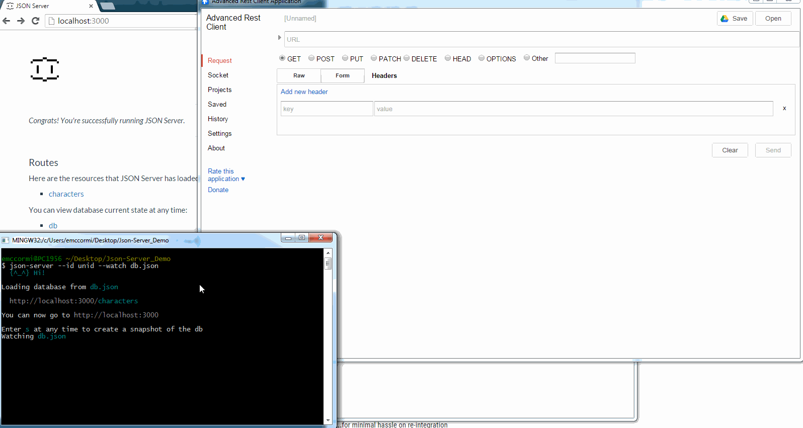
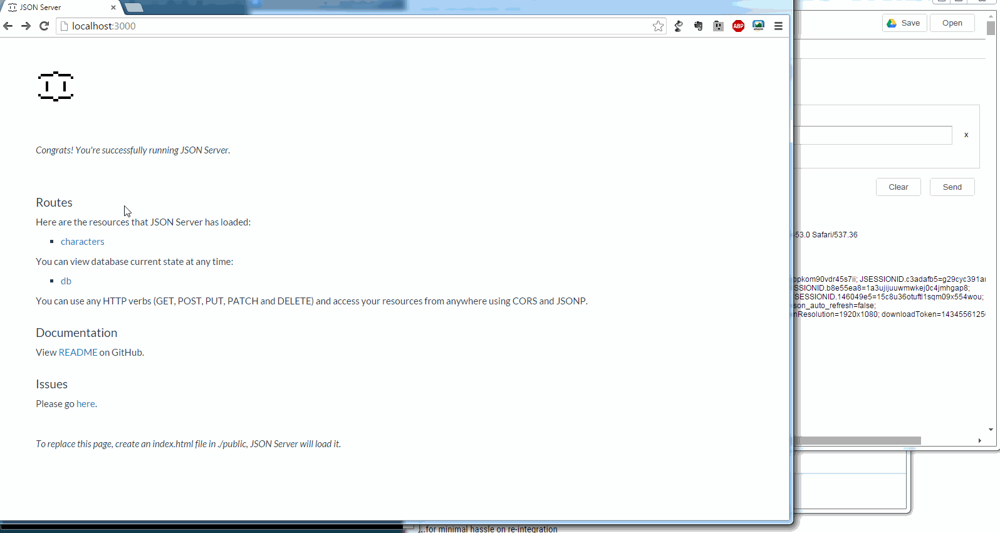

[Update]

This topic is so awesome I turned it into [a video for Notes in 9, check it out](/self-promotion/ni9-alt-front-end-dev).

[/Update]

<!--  -->

### Intro

It's no secret I'm a strong advocate for segregated application design practices. In my quest to "make everything work the way I want it", I've chosen a front-end framework that my ui-level application is written in, structured my primary application layer into RESTful Java `HTTPServlet`s (`DesignerFacesServlet`s, specifically), and life is generally good. My endeavors in this area are for a few, specific reasons, namely:

- keep my development efforts focused (e.g.- identifying whether a problem is front-end or back-end can greatly speed up trouble shooting)
- focus on data as a service (which makes it easily consumed by other systems)
- make more easily documented applications
- make more easily tested applications
- make applications more easily outsourced

That last one is probably foreign to a lot of people, but as one of two web developers on my company's organic staff (up from one, and the only Domino/XPages developer), this means I want to unify efforts across our application platforms and also make things easier to plug a contract developer into. It speeds up their efforts, makes it easier to plug into source control (for not just tracking, but also support purposes), and overall will aid my sanity (I hope).

### A Segregated Approach for the Front-End

I've spent a considerable amount of time covering the back-end approach that I'm migrating to; just [look at all but the last two-part piece in my series on Java HTTPServlets with XPages](/servlet-series/). But what if we hire out some work to be done on the front-end; wouldn't it be nice for that developer to work on _only_ on that front-end, without any need for other setup? I think it would and this ought to outline how this can be achieved fairly quickly.

### A Sample Data Set of JSON

Since I'm interacting with my data via a RESTful `HTTPServlet`, this makes things rather easy for me to create one of the required parts. I need to have a sample set of data, which I can interact with to confirm/deny my interactions are well formed and test with some form of data. In this case, I'm assuming this is for making changes to an existing application, but if it's a new one, someone would want to sit down and define a sample set of data; this is normal operation for myself and, I expect, most developers. For my use case, I copied the network response from my `.../xsp/<collectionName>` `GET` call into a `db.json` (I'm using `housesDB.json`, except for my GIFs below, which are another source, but follow the same structure) file. This will need one minor change, and that's to wrap the data array into a slightly different format, so that `json-server` can read it correctly (I stripped out my usual `request` block with any params and the `error` true/false, for simplicity).

After your minor transforms, I reocmmend sanity checking your data with a tool like [jsonlint.com](https://jsonlint.com/). You'll note my collection is a member of an `xsp` object (to route similar to my production path). Here's one I prepared earlier:

https://gist.github.com/edm00se/d2cc3f34562b4d4e9e7ae473e5ab1da2#houses.json

##### A Note on Domino Data Service

As the `@unid` property won't register as a valid json object property, you may need to transform that to `unid`. My `HTTPServlet` was already using `unid`, so it works out quite nicely 😉.

### Json-Server

So, you may be wondering what `json-server` is. [Json-server](https://github.com/typicode/json-server) describes iteself as:

> ...a full fake REST API with zero coding in less than 30 seconds (seriously)

I would call it an `application/json` mock back-end service. No matter how you slice it, it will take the contents of my `db.json` file and provide an endpoint for it to have the various CRUD operations performed against it. It respects well-formed CRUD operations, in `application/json` format, with `GET`, `POST`, `PUT`, `PATCH`, and `DELETE` operations.

To install it, you will need to have [Node.js (and npm!)](https://nodejs.org/) installed on your machine. I recommend installing this globally, so you won't need to maintain a copy of it in some project folder. To do so, from your command line, run:

`npm install -g json-server`

This will install the current version of `json-server`. What makes this all so exciting to me is that after [issue (feature request) 103 was completed](https://github.com/typicode/json-server/issues/103), the `id` property is now configurable. So, assuming a relative path to the `db.json` file, running the following gives you a functional back-end mock with the file above:

`json-server --id unid --watch db.json`

We're invoking the `json-server` command (that's right, npm installed it into our PATH, making it available as a global command), we're configuring the `id` to key off of the `unid` property, we'll be watching the file for changes, and it's pointing at the `db.json` file. By default, it will load on port 3000, but that's configurable as well. See the `json-server` read me on GitHub, or run it with no params or with -h for a listing of what's available (port is set by --port or -p).

### Examples

Here come a few examples, in all the glory an animated GIF of a REST API client can give.

##### Getting Started

You'll see that the default page at the port `json-server` is serving on, that there are a couple things, such as a hyperlink to the collections, overall "db", and link back to the readme on GitHub. In the console, we can see that we can even take a "snap shot" of the "db"; this will save the data at that point in time to a separate `.json` file.


##### GET Collection

I'm using the [Advanced REST API Client](https://chrome.google.com/webstore/detail/advanced-rest-client/hgmloofddffdnphfgcellkdfbfbjeloo?hl=en-US) for Chrome, as I'm used to it. You may wish to check out [Postman](https://chrome.google.com/webstore/detail/postman/fhbjgbiflinjbdggehcddcbncdddomop?hl=en), another Chrome app, or you can load from your JS console or, as [I'll show later, actual web content](#one-last-thing).



##### GET Record



##### PUT Record


ad nauseum

### One Last Thing

The part that makes this all so awesome, is how extensible this all is. For example, if I were to create a folder called "public" in the same path I'm running `json-server` from (with my `db.json`), `json-server` will pick up on that and display that set of contents instead of the default helper page. How is this useful? Well, check out this nifty example from my "App of Ice and Fire". You'll notice that the type of dataset is changing slightly (to be the same from that app), but otherwise it's the same.

##### Create Public Folder

I'm going to demonstrate this last bit with [my 'App of Ice and Fire' app](https://edm00se.github.io/AnAppOfIceAndFire). I'm setting the new db `.json` file in the root of the project folder and am symlink-ing a `public` folder to that app's `NSF/WebContent/` path (where my static files reside). To do this on a \*nix machine, change directory to the project folder and type `ln -s public NSF/WebContent/` and for a Windows command prompt, `mklink /d public NSF\WebContent` (if using the default Windows command prompt, you may need to "run as administrator" to get it to work). I added a symlink to my repository, which GitHub _ought_ to respect, but I don't want to duplicate the contents so it's in the `.gitignore` file; just know that when using a Git repository, all symbolic links should be relative.

With that in place, the only thing standing between myself and a working, non-Domino server, local copy of my static assets is to map the following into a `routes.json` file and add the parameter when I call `json-server`, like so:

```json
{
  "/xsp/houses": "/houses",
  "/xpp/houses/:id": "/houses/:id"
}
```

This will make my NSF-relative calls to `/xsp/houses` resolve to the `houses` that `json-server` is providing. Check it out. Our final command to start things up is:

`json-server --id unid --watch housesDB.json --routes routes.json`


##### Summary

I hope you can see the benefit of being able to work on your front-end independent of the server. With a little tweaking (I have some code in development that I would remove for production, checking to verify the formatting of my response in my `houseApp.js` to forcibly wrap my collection and document respectively), I'm now able to focus on all the ui-level application without needing to even touch my development server. To cross apply, I only have to paste into my `WebContent` path, without worrying if I'll break anything on the server. All in all, it's another good tool for the toolbox.

You can find these updates in my [App of Ice and Fire](https://github.com/edm00se/AnAppOfIceAndFire) repository on GitHub. Please feel free to check it out and play with it. Until next time.


