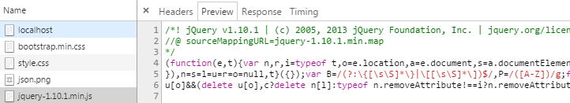

<!--  -->
<!--  -->

### Intro

I hope everyone in my region of the globe had a great Turkey Day. Yes, it's officially called Thanksgiving, but I'm usually thankful for my opportunity to charcoal grill a turkey which usually comes about once a year, so that's what I often lead with. If you have never had properly grilled turkey, I can honestly say you're missing out in life. For now though, I'll just wish everyone a great December and leave you with this (yes, it was as good as it looks, in spite of some crummy weather).

https://twitter.com/edm00se/status/669973030035169280

This series has been cooking longer than my turkey (about two weeks longer). It covers ground on a fair number of topics so please bear with me as we get started. I hope you'll find _something_ involved that makes you exclaim something to the effect of "that's really useful! How did I not know about this?! Thank you Eric, your talents and beard are so impressive!" Intrigued? I hope so.

### Why Should I Care?

A task runner is, at its simplest, a "worker" that peforms tasks (by configuration, definition, or defined standard). This can range from hooking into the npm scripts such as start or test in a `package.json` file (as npm and Node apps do) to more complex setups, such as those I'll get into. Here's a quick example of what I mean by the npm scripts in a node app's `package.json`:

```json
{
  "name": "ProjectName",
  "version": "1.0.0",
  "private": false,
  "scripts": {
    "start": "node app.js",
    "publish": "grunt && git subtree push --prefix site origin gh-pages"
  },
  "dependencies": {
    "some-awesome-package": "^1.0.0",
    "socket.io": "^1.3.7"
  },
  "devDependencies": {
    "grunt": "^0.4.5",
    "grunt-contrib-clean": "^0.7.0",
    "grunt-contrib-copy": "^0.8.2",
    "grunt-ejs-static": "^0.4.3"
  }
}
```

As you can see, this defines two "scripts" that npm will let us invoke from the command line; 'start' and 'publish'; I'm rather fond of the latter of those two, as it is a crafty way for me to be able to update the `gh-pages` (static site) associated with a GitHub repository, after performing the necessary build, all via my credentialed access. This is something that can be easily plugged into any Continuous Integration or Continuous Deployment setup, topics of which have been on my mind for the last few months. In short, with a single CLI entry, I can have current documentation automatically updated and published.

#### Background

The front-end web development scene is abundant with various tools and plugins designed to help make our lives easier. In my [next-to-last post](/web/the-right-tool-for-the-job), I showed how to get set up with some front-end tooling to pre-process our primarily markdown content and HTML partial driven structure of a site to create a full blown, static blog. This pre-processing of our assets can do lots of things like convert/parse content (like markdown to HTML) but can also be used against more "normal" web assets, for a more optimized delivery of our web content. Over the course of this series, I'm going to cover two popular and useful "task runners" which help with running (you guessed it) tasks such as minification of CSS, [uglification (think minification)](https://github.com/mishoo/UglifyJS2/) and concatenation of JavaScript, optimization of images, and even working in my previously document ability to work on the front-end of my application while [mocking the Domino back-end's servlet responses](/front-end/alternate-front-end-development). There are many more tasks that can be utilized, but those are the ones I'm focusing on as they have (for me) the most utility.

#### XPages

The subject of task runners is one where the XPages runtime, which is critical to my access to, and handling of, data and how it relates to my user's Session and contingent data stored in a Domino file is explicitly relevant to the back-end of my application. Since this series deals solely with the front-end, you won't see too much specifically relating to XPages controls or design elements. As far as I'm concerned, this highlights the flexibility of the XPages runtime, as I'm getting the best of both Domino/XPages and front-end tooling. For those of you that think this is out of your comfort zone, don't worry, we all develop for the web as it is, so it shouldn't be _too scary_; so please fasten your seat belts, [the exit is located here](https://www.notesin9.com/), and hold on for the ride.

#### Follow Along at Home

You can either use any existing web application you have, though if you're working against a Domino/XPages file, it's best if you were to refactor your client-side (web) static assets into your WebContent/ path into respective css and js (or styles and scripts, whichever is your fancy) directories. This means that when you run the task runner against your assets in your On Disk Project (ODP), you won't have to go searching very far and they'll match up with how many non-Domino web apps are structured.

If you need a copy, or just want to try it against someone else's code, here's one I prepared earlier.
You can either clone the ODP in full or follow the next set of steps for a sparse checkout (which will pull down only what's needed for the client-side assets and the mocked back-end via json-server, as I've previously identified)
URL: `https://github.com/edm00se/AnAppOfIceAndFire.git`

##### You Should Have

* [git](https://git-scm.com/)
* a current version of [Node](https://nodejs.org/en/) <s>or [io.js](https://iojs.org/en/)</s> (with npm package manager) *note: [io.js merged with Node](https://www.linuxfoundation.org/news-media/announcements/2015/06/nodejs-foundation-advances-community-collaboration-announces-new) again (ca. June 2015), so it's probably best to skip io.js if you're not familiar with the distinction
* familiarity with git (either CLI or SourceTree)
* an application's client-side / front-end assets against which to work (or follow my next section to clone the necessary parts from a repository of mine)

##### A Git Sparse Checkout of An App of Ice and Fire

This will perform a [git sparse checkout](https://stackoverflow.com/questions/600079/is-there-any-way-to-clone-a-git-repositorys-sub-directory-only/13738951#13738951) of the required web assets and back-end mocking software. I am assuming you have a working copy of git installed (fairly recent) and a working install of node <s>or io.js</s> with npm. Don't worry about bower and json-server, if you don't have them, a command below will install them as a dependency into your local repository, per the specification in the package.json.

  - create a new directory to work from, it will be pulling from a git repository (using the [sparse checkout](https://stackoverflow.com/questions/600079/is-there-any-way-to-clone-a-git-repositorys-sub-directory-only/13738951#13738951))
  - change directory into it
  - perform a `git init`
  - add the URL to my repository via `git remote add -f origin https://github.com/edm00se/AnAppOfIceAndFire.git`
  - now you have an empty repository with the remote established (to the GitHub repository, calling itself "origin")
  - configure the repo for sparse checkout via `git config core.sparseCheckout true`
  - now we need to create and add the correct configuration to our `.git/info/sparse-checkout` file for it to know what to pull from the server copy this in:
    - ```sh
      # .git/info/sparse-checkout
      .gitignore
      package.json
      .bowerrc
      bower.json
      db.json
      routes.json
      NSF/WebContent/
      ReadMe.md
      ```
  - now we just need to pull the specified parts down into our local repository, via `git pull origin master`
  - now the usual npm dependencies, via `npm install` (the npm dependencies will install into `node_modules/`
  - now we install the bower components via `bower install` (don't worry, it's a listed dependency, along with json-server, so the last line will have installed it; just not globally); the bower dependencies will install into `NSF/WebContent/libs/` (which the code expects)
  - lastly, we need to create a symbolic link of `NSF/WebContent/` to `public` for our json-server to pick it up where it's expected
   - for *nix and Mac operating systems, the command is `ln -s NSF/WebContent/ public`
   - for Windows, you'll need to start up the command prompt (from the Start/search, "cmd", right-click and select "run as administrator")
     - change directory to the root of the working git repository we set up, then run `mklink /d public NSF\WebContent`
  - don't worry about duplicate data, these are both methods for a symbolic link, meaning it's the same file, with multiple path pointers (and the `.gitignore` file is set up to ignore the public path, so we won't pollute our repository with duplicates)
  - if you forget to set up the symlink, it will give you a screen like this, which basically announces that the resource end points are available, just without any other content being served (handy if you want to test the data structure without worrying about a full UI; aka- via [Postman](https://www.getpostman.com/) or another REST API client); so go create that symlink!
  - 

##### Up and Running!

Give it a test by running from the root of the project folder `npm start`. This runs the command [I outlined in my blog post](/front-end/alternate-front-end-development) and [corresponding Notes in 9 episode](https://www.notesin9.com/2015/09/01/notesin9-180-alternative-frontend-development-for-xpages/) on the subject of alternate front-end development with Domino/XPages. Again, this is just mocking the back-end for front-end development, but gives us flexibility for this sort of thing. You can view what npm executes as the "start" command by looking in the `package.json` file at the corresponding JSON key'd "start" line inside the "scripts" object (because `json-server --id unid db.json --watch --routes routes.json` is a fair amount to remember).
Your CLI will report back the full command I set up as the "start" script for json-server and announce that there are resources available on localhost at your given port (likely 3000) and that other routes exist (my routing to map up to my _DesignerFacesServlet_s, as documented in my [series on servlets](/servlet-series/)).
If you load up `https://localhost:300` in your web browser, you'll find the front-end of the application running. If you forgot to symlink `public` to `NSF/WebContent/`, you'll be greeted with a generic json-server page stating the resources available it loaded from my mock `db.json` file.

### What is a Task Runner Anyway?

The two task runners that I'll cover and are best known are [Grunt.js](https://gruntjs.com/) and [Gulp](https://gulpjs.com/). There are more, lots more, and some are designed to be extensions of these two, such as Yeoman, which started with Grunt but now works with both, for scaffolding applications quickly, or slush, which does the same but is geared solely for gulp.

A task runner is really just a tool that can process defined tasks on command. These tasks usually take a little configuration the first time, but pay off dividends as they automate the process for every subsequent run. Once it's established, running the task runner is usually as simple as invoking `grunt` or `gulp`, which then perform the defined tasks in their corresponding `Gruntfile.js` or `gulpfile.js`. I'm going to focus on using Grunt for now, though gulp is certainly worth checking out.

### Tasks

I'm going to focus on two primary tasks that will universally apply to everyone and one bonus task that should apply to many people. Those tasks are optimizing a distribution version of our CSS, JavaScript files, and images. I'm not going to get into some of the fancier tasks that many tend to set up such as live reload, serving tasks (for local preview, with or without a 'watch' task to see if a file has been changed/saved), or unit tests; these and many more are out there.

#### CSS and JavaScript

The major tasks I'll be accomplishing are with minification and concatenation. Minification removes unnecessary white space (that makes it human readable while in development but is not necessary to parse properly) and concactenation is the joining of multiple files, to decrease the number of network requests. This is the same for both CSS and JavaScript, with the exception of the "uglifier" with JavaScript can actually re-write JavaScript function and variable names to smaller, usually single-letter, names. You can see this sort of thin at work with many vendor JavaScript libraries, such as jQuery, Dojo, Angular, or others; just look at the source of a *.min.js file.



We will set up a task for our CSS and JavaScript files to accomplish about the same results.

#### Images

Images are tricky in that they only get rendered in the dimensions they are displayed at. Quite frequently, an image is slightly larger than it needs to be. We will set up a task to detect and optimize our image tagged files accordingly.

### To Be Continued...

...in part 2, soon, covering the install and use of Grunt.
