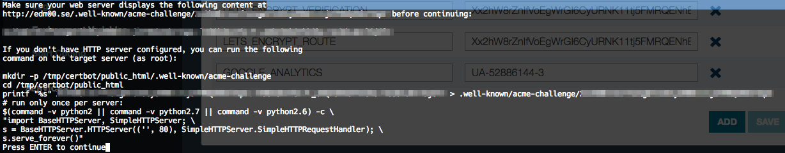
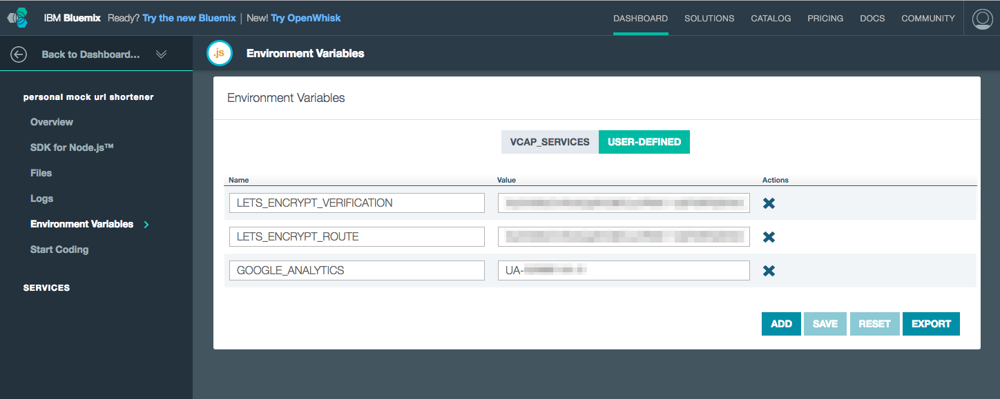
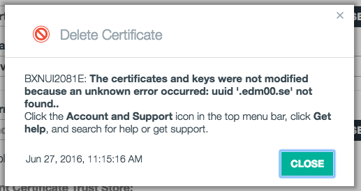

### Intro

A while back, I rolled [a personal project](https://github.com/edm00se/personal-mock-url-shortener), which is a Node app, to Bluemix for lightweight use. I managed to make use of [Let's Encrypt](https://letsencrypt.org/) for the HTTPS certificate, but only after realizing that there was a bit of a manual aspect to it that is the antithesis of [an automated script for such things](https://certbot.eff.org/). Ultimately, after finding some information in [a blog post form Marky Roden](https://xomino.com/2016/02/09/using-lets-encrypt-to-create-an-ssl-certificate-for-my-bluemix-hosted-web-site/) (of all people), I was able to get moving. The only downside wound up being that time passed, and [it came time to renew the certificate before my 90 days was up](https://letsencrypt.org/2015/11/09/why-90-days.html). Thankfully, I had done some minor documenting of the steps I took, which made updating the HTTPS certificate a bit easier. What follows is some of how I configured my application for easier implementation.

### The `.well-known/acme-challenge` Route

As part of the validation process, the Let's Encrypt / certbot script needs to "call home" to verify your server is who it claims. The exact command I ran with `certbot-auto` followed the format of:

https://gist.github.com/edm00se/3bc4043c19537dd3958c7af42a9618d6#certbot-script.sh

\*note: you can add `--dry-run` to the end to... perform a "dry run"

Here's what it looks like when I ran the `certbot-auto` script:

Marky's example shows handle established in his Node + Express app, providing a response on the given relative path of `<domain>/.well-known/acme-challenge/<uuid-string>`. This is something that would require manual updating of the code base, so it's naturally the first thing I removed. This was a perfect job for a pair of environment variables, in my opinion. I [implemented it in the code as such](https://github.com/edm00se/personal-mock-url-shortener/blob/28ea4f1651f2729d466aa7a3bdee4bd11f11ad35/routes/index.js#L8-L10):

https://gist.github.com/edm00se/3bc4043c19537dd3958c7af42a9618d6#lets-encrypt-endpoint.js

This means that so long as my Node app can resove the `LETS_ENCRYPT_ROUTE` and `LETS_ENCRYPT_VERIFICATION` values accordingly, I'm in business. This is done rather easily via the "Environment Variables" page of my application's dashboard, in the "user defined" tab.

Once this is all done, you can replace the certificates for the custom domain with the freshly generated certificates. I added my certificate files (`.pem`) as the screen shot shows and it looks good in both the Bluemix dashboard and my Chrome inspector.

### Sequence of Events

Generally speaking, the order of events to take are:

- ensure you have the [`certbot` script](https://certbot.eff.org/) on the machine you'll be generating the certificates on
- ensure your custom domain is set up
- log into your Bluemix dashboard and go to your environment variables to update with values from the `certbot` script
- run the `certbot` script, obtain the values for the URL path and the response value
- enter those as the corresponding environment variables (allow for the app to restart, as needed)
- continue the `certbot` script, which should now successfully validate

### One Hiccup

A strange hiccup I encountered was what I believe to be a false positive in regards to my deletion of the existing (old) certificate. After a few tries, or a minor passage of time, it all rectified itself.

### Thoughts

Since Let's Encrypt is now by all regards [widely successful, with over 5 million certificates issued](https://letsencrypt.org/2016/06/22/https-progress-june-2016.html), I can't help but wonder how easy this _should_ be on any modern PaaS, such as Bluemix. Gone are the days of _needing_ to pay _lots of money_ for an HTTPS certificate, so the automation, configuration, and management of HTTPS certificates on behalf of the user _should_ be a minor formality, not to mention useful. Do note, Bluemix does have a wild card HTTPS certificate which applies to any of its `.mybluemix.net` addresses, so this is unique to custom domains.

### One Last Call For MWLUG

[MWLUG](https://www.mwlug.com/) 2016 is nearly here. If you're able to, I really recommend coming to the event, as there are a great many people with a passion for what they do, who are looking to share. It's been a great event each time I've had the pleasure to attend and I'm glad to be going back, and speaking.

You can find me on Friday, the 19th of August, in Ballroom D, from 1:30pm - 2:30pm. It's my aim to expand a bit on the theme I've settled on over the last year, which is a combination of best practices for stability, maintenance, and documentation, along with the incorporation of front-end tooling to enhance the developer's workflow (full abstract below) and ease the task of multi-platform development capabilities. I hope to see you there! 🍻

#### BP101: A Modernized Developer's Workflow with Domino/XPages

Watch, listen, and feel free to follow-along with a full-stack approach to how to build better applications with Domino/XPages, MVC principles in action in the back-end, RESTful API creation, along with advanced framework implementation in the front-end, with advanced tooling to help automate our coding process, unit tests, and even the ability to mock the back-end for front-end development outside of Domino Designer. This session seeks to help developers advance their workflow and produce higher quality, more performant and optimized applications with the Domino server they already have and the modern front-end tooling they want to incorporate.
