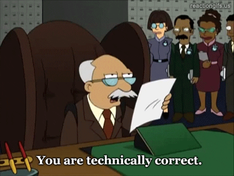

I know it's been a while, figured I'd pop up write a quick blog.

{.skinny}

Numbers came up as a topic today, you know, thse primitive entities in JavaScript. Yeah, I was surprised as well.

### The Problem

Whether this is truly a problem is debatable. Working in an almost exclusively node and TS/JS context these days, my code lives and dies based on what my runtime supports. Usually this is defined by [node and its implementation of the v8 engine](https://nodejs.dev/en/learn/the-v8-javascript-engine/). Today this means specifically its implementation of [JSON](https://developer.mozilla.org/en-US/docs/Web/JavaScript/Reference/Global_Objects/JSON) and its [`parse`](https://developer.mozilla.org/en-US/docs/Web/JavaScript/Reference/Global_Objects/JSON/parse) and [`stringify`](https://developer.mozilla.org/en-US/docs/Web/JavaScript/Reference/Global_Objects/JSON/stringify) methods. I thought I knew about everything there was to know about JSON, short of [JSON 5](https://json5.org/) which sadly looks like [it won't be supported by node anytime soon](https://github.com/nodejs/node/issues/40714), but while unsurprised, I learned something today.

The short version is that numeric values in JSON strings need to be valid `float`s or `int`s, this shouldn't be a surprise to anyone experienced with JavaScript. Where the rubber meets the road is that in the process of `JSON.stringify`ing or `JSON.parse`ing, any trailing `.0` on a numeric value will be stripped. Of course it still is of the correlating value, and if decimal places are needed, you _could_ pass the value as a string, but that's silly. What's also silly is the inevitable kickback one could get when matching an existing system's output when migrating to a new one.

### Why Is This a "Problem"?

As far as I can tell, the previously generated output was coming from a C based runtime that was generating the output with complete abandon for the ultimate JSON output itself. It succeeded in creating a numeric value that was parsable as either a `float` or `int`, making it technically correct, but mildly unhelpful and an annoyance for me, here _in the future_. JavaScript, JSON parse, and JSON stringify will each strip the `.0` specificity as its unnecessary for it as a numeric value, either as an `int` or `float`; it's just not needed and any need to _display_ the value differently would likely require using [`.toFixed`](https://developer.mozilla.org/en-US/docs/Web/JavaScript/Reference/Global_Objects/Number/toFixed), because that's a function of display, not numeric value.

{.skinny}

### An Example

https://codesandbox.io/embed/json-and-number-precision-wz8hg2?fontsize=14&hidenavigation=1&theme=dark

### Summary

When in doubt, check what you know. We'll see whether I need to do some custom string processing or not; preferably the latter. Still, I've gone down [the custom JSON serialization path before](/java/custom-json-serilization/), but that was on another platform with different tooling and reasons. Until next time.
