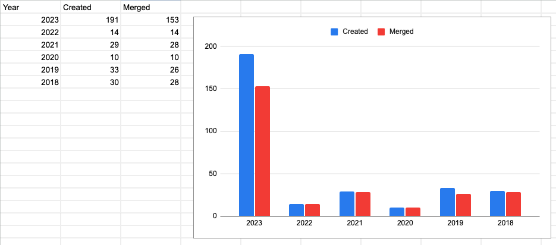
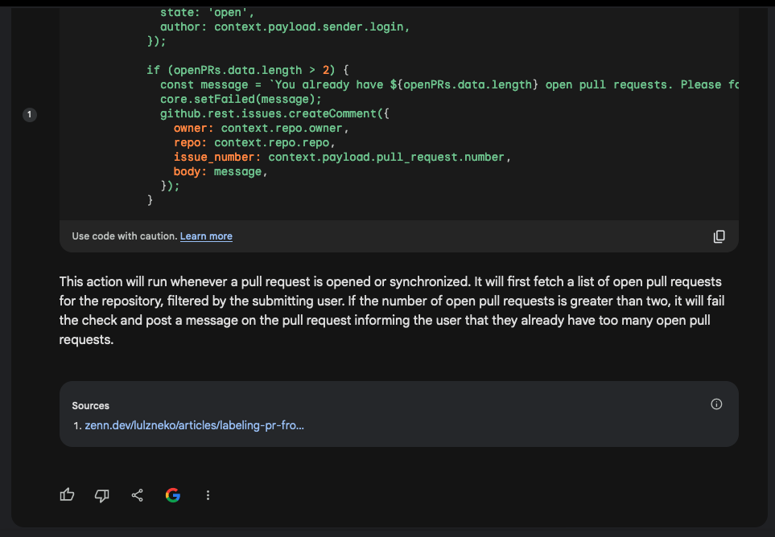

Happy November everybody! I made it through October and in spite of some of the doom and gloom to come in this one, I still had _some_ fun in moderating my usual contributing open source repository to Hacktoberfest.

### Hacktoberfest 2023 and Lessons Learned

Since 2018, I've been not only participating, but opening up an open source repostiroy of mine for contributions with [Hacktoberfest](https://hacktoberfest.com/). This was Hacktoberfest's 10th year and I've contributed for most of them, but the desire to contribute a repository was born from a desire to share something fun and help others gain in the ways of open source contribution. This year didn't go perfectly, they never do, and I had to learn a few things, which I usually do. Primarily of note this year was that the amount of traffic my humble repo got was significantly larger than any previous year. How much more? One eager individual submitted 17 PRs immediately and all together, which is more than I had a couple of years. Here's some data for those that like such things.



If you're looking to get some Pull Request data, my search filter to limit by creation within a given month of a year and remove dependabot looks like this:

```
is:pr created:2023-10-01..2023-10-31
```

To filter out dependabot, which showed up under two names in my repo, add `-author:app/dependabot -author:app/dependabot-preview`.

If you want to see merged, tack on `state:merged` to that query. [Here's the merged search for this October for reference](https://github.com/edm00se/awesome-board-games/pulls?q=is%3Apr+created%3A2018-10-01..2018-10-31+-author%3Aapp%2Fdependabot+-author%3Aapp%2Fdependabot-preview+state%3Amerged+).

### When Do The Bots Come In?

A little over a week into October, I had realized I had a problem. I knew I had to do something as nearly a hundred PRs had been opened within the first two weeks. So I did what any seasoned developer would do, I looked for a "cheat" to speed up my efforts. Enter the bots. I decided to see what responses I would get from some of the LLM chat "AI" interfaces in an attempt to compare them and see how close to a working output I could get without needing to do the work myself; the adage of "a good developer is a lazy developer" comes to mind.

### The Showdown

I began by asking for a [GitHub Action](https://github.com/features/actions) that would suit my needs, specifically one to detect other open PRs by the author and fail the check should it be over a specified threshold. I then asked for the bot to update should I apply the "hacktoberfest-accepted" label, allowing me as the maintainer to effectively override this, since I did expect a few log jams that could need clearing. I repeated this two part request for each of those I tried out. I also only tested those I could use for free, because this was a one-off and I'm a bit of a cheap skate with disposable technology.

#### [OpenAI ChatGPT](https://chat.openai.com) (3.5, aka the free one)

I began with the one that is frequently talked about most. I was a bit surprised by this one as it had my highest expectations, in spite of low expectations in general. On the first ask, I was given a mild surprise as I was returned code in two parts, not one. The first was a node script using `@actions/core` and `@actions/github` to do the heavy lifting. It reads about how you would expect.

https://gist.github.com/edm00se/7e03ec794c947f58ec376b38920632ab#1a_openai_script.js

The wiring up of the GitHub Action via its workflow YAML was also quite straight forward. It checks out the code, installs the node dependencies, then executes the script.

https://gist.github.com/edm00se/7e03ec794c947f58ec376b38920632ab#1b_openai_config.yml

After my follow up to allow for allowing for the label to override the failing check when present.

https://gist.github.com/edm00se/7e03ec794c947f58ec376b38920632ab#1c_openai_updated_script_snippet.js

#### The Other Thing

The Eagle eyed among you may have noticed something which dates the response and the built LLM a bit. While everything seemed functional, the node version specified was node 14. Node 14 was in active LTS for a while, then moved to maintenance for security updates, and then was End Of Life'd in April of this year (2023) in accordance with the [node release schedule](https://nodejs.org/en/about/previous-releases). I asked for it to be updated to latest LTS and was basically told to figure it out myself.


I know many like to joke about the volatility and pace of web development compared to other development circles, but I found it a little remarkable that ChatGPT couldn't just do a basic query to at least tell me what to update to for the latest LTS. It's not that I needed it, but that it would be incredibly simple and highlights the limits of LLMs being trained as they were when that one was built.

#### Verdict

This wasn't a bad place to start, but I decided to try the others once this split the fiels into two. This combined with the dated knowledge of node made me wonder if that was what I should persue as I was really looking for a drop-in solution that required no other files.

#### [Google Bard](https://bard.google.com)

Bard started strong, rolling up all the work into a single step and making good use of the `actions/github-script` to both attain the needed dependency functionality and also keep it inside the one file. Note: in no cases did I specify the desire for a single file, but nearly all returned with a single file. Here's what it returned after my update to request the label to escape the condition.

https://gist.github.com/edm00se/7e03ec794c947f58ec376b38920632ab#2b_bard_action_updated.yml

A nice feature I noticed only for Bard was the citation of sources. That's right, they call it out with a numbered marker on the side, clicking on it gives the hyperlink, as does it show in the footer of the response. This was an immensely useful feature and it didn't matter that the cited link was in Japanese, using Google Translate I was then able to read and understand the majority of the source. That the source was cited and that it was done with specificity as to what component it was generating gave me some level of assurance either to vet the information myself or at least know who to blame 🙃.



#### Verdict

This looked promising, so promising that I attempted to implement the action, in a test repository at first. Until it was deployed in my actual repository with other people submitting PRs I didn't realize that I was apparently the noted "author" and had to make more changes. So this one was my starting point, but it was no out of the box working experience. That said, knowing the source it used to help come up with the answer was good, in that I could read up on what the human being that it pulled from was talking about.

#### [Claude](https://claude.ai)

For any who aren't aware of it, Claude is made [by Anthropic and at least claims](https://www.anthropic.com/index/introducing-claude) to train its models to be "helpful, honest, and harmless". What that functionally means, I'm not entirely certain of, but with any luck it means they aren't stealing some [poor artist's exposure bucks](https://theoatmeal.com/comics/exposure). On first request, it gave me something that wouldn't work, then on calling it out it gave me back the exact same script, except that it had capitalized the word "count". Maybe this sort of question isn't the sort Claude is good for as I've had a couple decent interactions with other tests I've run. See if you can spot the issue.

https://gist.github.com/edm00se/7e03ec794c947f58ec376b38920632ab#3b_claude_aciton_updated.yml

Right out the gate, wherever Claude pulled this from was attempting to execute the action only on `workflow_dispatch`, which being familiar with GitHub Actions I can tell you is only [for manual invocations](https://docs.github.com/en/actions/using-workflows/events-that-trigger-workflows#workflow_dispatch), meaning someone would have to go to the Actions tab in the repository and click the "Run Workflow" button. It looked like the assumption from the response was that I'd be providing both the author and repo name and it would spit back the number count of `state: open` PRs, as detected via `octokit/request-action`.

#### Verdict

This wasn't for my need, so I moved on.

#### Bing Chat

Officially, Microsoft's Bing team acts like Bing Chat is only available from MS Edge. In reality, if you have [the relevant URL](https://www.bing.com/search?q=Bing+AI&showconv=1&FORM=hpcodx), you can get to it from presumably any modern web browser. Also, I didn't add this one until after I solved my problems. It was a bit of code that I needed to implement with some urgency. That said, I'm somewhat disappointed I didn't think to check Bing Chat's response at the time, as I rather enjoy that in spite of being written primarily as a BASH script, it makes use of the GitHub API directly to get the data needed and does so with an apparently decent amount of knowledge as to what I was looking for. Here it is after being updated to allow for the label escape.

https://gist.github.com/edm00se/7e03ec794c947f58ec376b38920632ab#4_bing_chat_action_updated.yml

#### Verdict

I was intrigued, in spite of having already moved on. Maybe I'll consider checking against Bing in the future, as this seemed the most cohesive and likely to work out of the box. Then again it carries a downside of bing a BASH script at its heart, not a problem per say, but I do spend most of my time in JS/TS/Node and something in that flavor makes it instantly more easy to maintain.

### How I Concluded Things

Ultimately, I was pressed for time and had to go with the one I felt most comfortable with, the Bard solution. As I mentioned already I had to change things after I realized it didn't do _exactly_ what I needed to, after having implemented it live; there's nothing like testing in prod as they say. In any case, here's what I came up with in the end. I tried to lean hard into the using the steps as the logic, had to forcibly filter the open PRs so it wouldn't confuse all of those in my repo with the PR author's, set that as output from the step, which I could use to drive the message and fail or succeed steps accordingly. It's not perfect, but I can easily maintain it and it helped a fair amount for the remainder of the month since it went online over [`240 workflow runs`](https://github.com/edm00se/awesome-board-games/actions/workflows/limit-prs.yml). Here's a copy, otherwise [you can see it where it lives](https://github.com/edm00se/awesome-board-games/blob/65a2f528c076f9d66179d59a7fa152d918a35c6d/.github/workflows/limit-prs.yml).

https://gist.github.com/edm00se/7e03ec794c947f58ec376b38920632ab#my_final.yml

### Take Aways

Ultimately, I still had to write some of it at the end of the day. I was almost disappointed, but my expectations going into it weren't for anything truly magical. For many it may have been a help to have a starting point, but as someone who's both familiar with writing GitHub Actions and other scripts for automation, I'd call it a bit of an draw since I spent more time debugging what had gone wrong in the example I was given, rather than just writing it myself. In short, my day job is secure, at least for a while.

Until next time, cheers. ☕️
